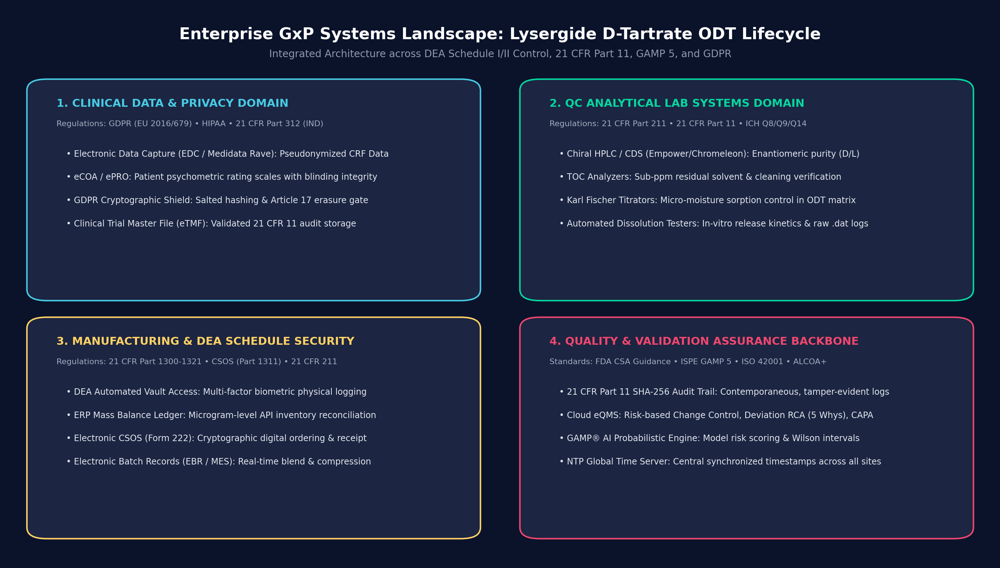
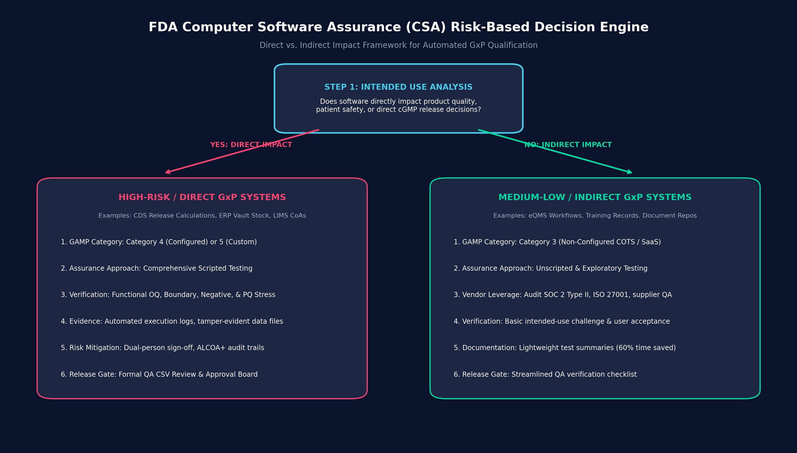
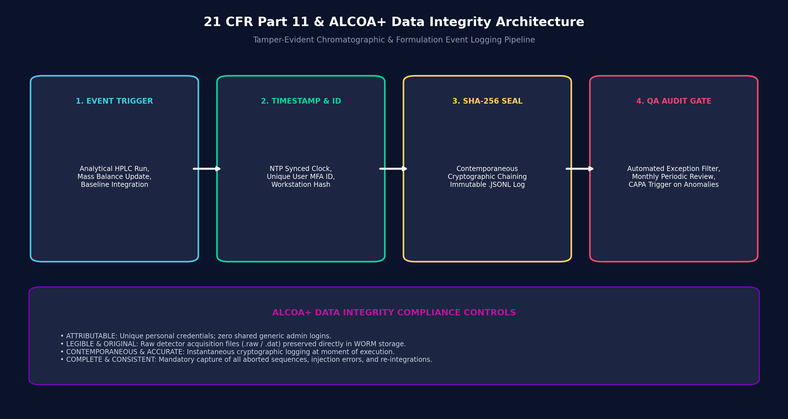
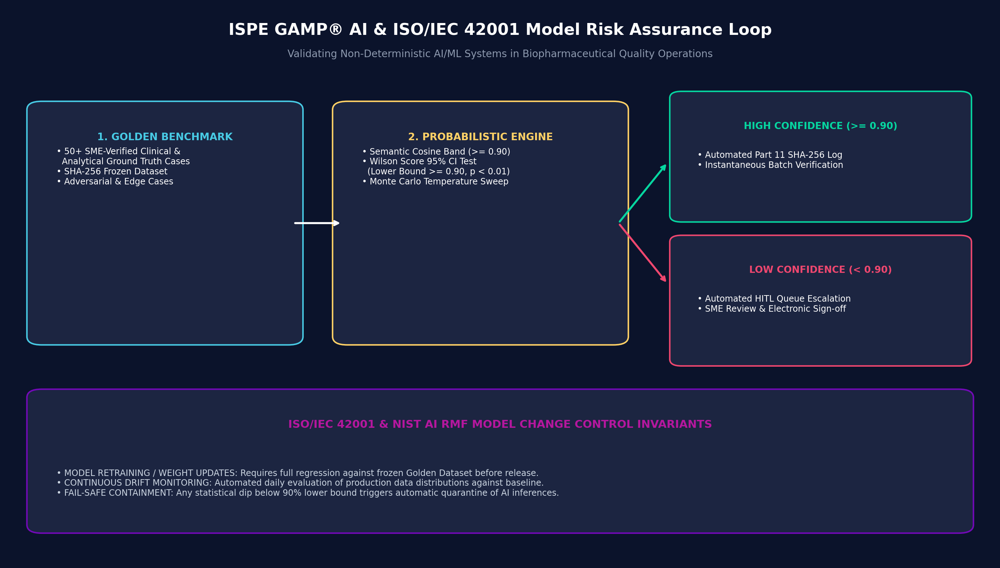

# GxP Computerized System Assurance (CSA) & Regulatory Compliance Blueprint
### *Lifecycle Quality, Computer System Validation (CSV), and Data Integrity Architecture for Lysergide D-Tartrate Orally Disintegrating Tablets (ODT)*

[](https://www.fda.gov)
[%20%7C%20GAMP%20AI-orange.svg)](https://ispe.org)
[-green.svg)](https://www.fda.gov)
[](https://www.deadiversion.usdoj.gov)
[%20%7C%20HIPAA-purple.svg)](https://gdpr.eu)
[](https://www.linkedin.com/in/justinarndt)

---

## Executive Overview

Late-stage biopharmaceutical manufacturing and clinical development operate at the intersection of stringent health authority mandates, cutting-edge drug delivery mechanisms, and modern cloud-native architectures. 

This repository serves as an end-to-end **Quality Assurance (QA) and Computerized System Assurance (CSA)** blueprint specifically engineered for the lifecycle of **lysergide (LSD) D-tartrate orally disintegrating tablets (ODT)**—a micro-dosed psychiatric therapeutic indicated for Generalized Anxiety Disorder (GAD), Major Depressive Disorder (MDD), and Post-Traumatic Stress Disorder (PTSD)—as well as next-generation early-pipeline enantiomers (DT402 R-MDMA for Autism Spectrum Disorder).

This blueprint operationalizes:
1. **FDA 21 CFR Part 11 & EU Annex 11:** Immutable, contemporaneous cryptographic audit trails and electronic signatures.
2. **FDA Computer Software Assurance (CSA) & ISPE GAMP® 5 (Second Edition):** Critical thinking and intended-use risk gating to replace low-value screenshot testing with rigorous unscripted and automated verification.
3. **DEA Controlled Substance Compliance (21 CFR Parts 1300–1321 & CSOS Part 1311):** High-precision physical and electronic mass-balance custody ledgers.
4. **ICH Q8 / Q9 / Q10 / Q14:** Quality-by-Design (QbD) control of Critical Quality Attributes (CQAs) across chromatographic and physical testing systems.
5. **GDPR (Regulation EU 2016/679) & HIPAA:** Protection of clinical trial subjects' pseudonymized data, blinding hash integrity, and cross-border transfer controls.
6. **ISPE GAMP® AI & ISO/IEC 42001:2023:** Validation protocols for probabilistic AI/ML systems and automated pattern-recognition tools in GxP environments.

---

## 1. Enterprise System Landscape & Regulatory Boundary

The qualification boundary spans four core operational clusters: Clinical Operations, QC Analytical Laboratories, Manufacturing/Vault Security, and Enterprise Quality Infrastructure.



### Multi-Jurisdictional Regulatory Matrix

| Jurisdiction / Standard | Operational Scope in Lysergide ODT Lifecycle | Target Computerized Systems | Core Validation Deliverable |
| :--- | :--- | :--- | :--- |
| **FDA 21 CFR Part 210/211** | cGMP finished pharmaceutical manufacturing, batch release, blend uniformity, dissolution kinetics | Electronic Batch Records (EBR/MES), ERP, QC Lab Instruments | Validation Master Plan (VMP), IQ/OQ/PQ Protocols, VSR |
| **DEA 21 CFR Part 1300–1321 & CSOS (Part 1311)** | Controlled substance API storage, microgram-level mass balance, digital electronic ordering (Form 222) | Automated Vault Access Systems, ERP Inventory Modules, CSOS Signatures | Security Qualification, Perpetual Ledger Verification, CSOS Audit Trail Review |
| **FDA 21 CFR Part 11 & EU Annex 11** | Electronic records, electronic signatures, raw chromatographic data integrity, ALCOA+ principles | Chromatography Data Systems (CDS), TOC Analyzers, Karl Fischer Titrators | Audit Trail Review SOP, User Access Matrix, Part 11 Gap Assessment |
| **FDA CSA Guidance (2022) & GAMP 5 (2nd Ed.)** | Risk-based intended use categorization, scripted vs. unscripted testing allocation | Cloud SaaS eQMS, LIMS, Deviation/CAPA Routing Platforms | CSA Risk Assessment Matrix, Unscripted Test Challenge Records |
| **GDPR (EU 2016/679) & HIPAA** | Phase 2b/3 multi-center clinical trials, patient psychometric rating scale privacy, blinding maintenance | Electronic Data Capture (EDC / Medidata Rave), eCOA, ePRO | Blinding Integrity Protocol, GDPR Article 17 Shield Architecture |
| **ISPE GAMP® AI & ISO/IEC 42001** | Process Analytical Technology (PAT), Raman spectroscopy dissolution prediction, automated triage | AI/ML Inference Engines, Predictive QC Algorithms | Probabilistic OQ Protocol, Wilson Score Confidence Analysis |

---

## 2. Critical Quality Attributes (CQAs) of Lysergide ODT & Instrument Qualification

Orally disintegrating tablets of lysergide D-tartrate present distinct analytical and formulation challenges:
* **Micro-Dose Potency:** Dosing ranges typically span 25 µg to 200 µg per unit, requiring extreme blend uniformity and sub-microgram analytical precision.
* **Chiral Purity & Enantiomeric Separation:** Lysergide contains two chiral centers ($5R, 8R$). Degradation or epimerization yields *iso*-LSD ($5R, 8S$) or inactive enantiomers.
* **Rapid Disintegration (<30 seconds) & Moisture Sorption:** ODT matrices utilize highly hygroscopic superdisintegrants that are acutely sensitive to ambient relative humidity.

| Critical Quality Attribute | Qualified Instrument / System | Data Integrity / CSV Control |
| :--- | :--- | :--- |
| **Chiral & Chemical Purity (D-lysergide vs. iso-LSD)** | Chiral HPLC / UPLC CDS (Empower / Chromeleon) | Raw .dat file custody, baseline re-integration audit alerts |
| **Moisture Sorption & Solvent Residuals (< 1.5% H2O)** | Karl Fischer Coulometric Titrators & TOC Analyzers | Automated drift-compensation logs, direct balance RS232/Ethernet link |
| **Sub-30s Disintegration Rate & Friability (<0.5%)** | Automated Disintegration & Optical Texture Analyzers | Tamper-evident sensor time-stamps, raw optical curve file retention |
| **Microgram Mass Balance & Schedule API Chain-of-Custody** | DEA Automated Vault Access & ERP Inventory Ledger Module | Multi-factor biometric access, SHA-256 sealed transaction logs |

Detailed instrument qualification test scripts (IQ/OQ/PQ) and user requirements specifications (URS) are documented in [`docs/02_odt_lysergide_cqa_instrument_validation.md`](docs/02_odt_lysergide_cqa_instrument_validation.md).

---

## 3. FDA Computer Software Assurance (CSA) Risk-Based Engine

Traditional Computer System Validation (CSV) spent 80% of effort generating paper documentation (screenshots of standard software menus) and 20% on actual risk testing. **FDA Computer Software Assurance (CSA)** shifts the focus to critical thinking and intended-use risk analysis.



### The CSA Intended-Use Framework

1. **Direct Impact Systems (High Risk):** Software directly responsible for product quality, batch release decisions, or patient health (e.g., HPLC CDS peak calculation algorithms, ERP DEA vault mass-balance gating).
   * *Assurance Method:* Formal scripted Functional OQ/PQ, stress and boundary testing, negative failure-injection testing, and formal QA CSV board sign-off.
2. **Indirect Impact Systems (Medium/Low Risk):** Software supporting operational workflows or quality management (eQMS CAPA routing, document management systems, training trackers).
   * *Assurance Method:* Unscripted exploratory testing, leveraging supplier qualification (SOC 2 Type II, ISO 27001, supplier QA audit evidence), reducing documentation overhead by over 60% while elevating focus on patient-safety risks.

The complete risk assessment workbook is available in [`docs/03_csa_risk_assessment_framework.md`](docs/03_csa_risk_assessment_framework.md).

---

## 4. 21 CFR Part 11, EU Annex 11 & ALCOA+ Data Integrity

In analytical and clinical operations, raw electronic records are the primary legal evidence of batch quality. This framework enforces **ALCOA+** principles through cryptographic event logging and rigorous procedural oversight.



### ALCOA+ Data Integrity Controls

* **Attributable:** Unique multi-factor credentials for every operator; zero shared generic accounts. Workstation ID, IP address, and role are immutably captured.
* **Legible & Original:** Raw chromatographic data (.raw / .dat) and detector integration logs are written directly to Write-Once-Read-Many (WORM) cloud storage with automated integrity checksums.
* **Contemporaneous:** Universal synchronization with Network Time Protocol (NTP) stratum-1 time servers across all analytical instruments and cloud servers.
* **Accurate & Complete:** Mandatory capture of all system events, including aborted chromatographic runs, instrument communication failures, manual baseline readjustments, and sample sequence reordering.

### Audit Trail Review SOP Highlights
* **Automated Exception Triggers:** Real-time email and eQMS alerts triggered upon:
  * Manual peak re-integration in HPLC runs.
  * Audit trail disabling or system clock adjustments.
  * Failed user authorization attempts exceeding threshold ($\ge 3$).
* **Periodic Review Cadence:** Monthly formal QA audit trail reviews and pre-batch release verification sign-offs.

The standard operating procedure is documented in [`docs/04_audit_trail_and_part11_sop.md`](docs/04_audit_trail_and_part11_sop.md).

---

## 5. IT SDLC, Change Control & Deviation / CAPA Playbook

Computerized systems in regulated biomanufacturing must maintain steady-state compliance throughout their lifecycle.

### Regulated Change Control Classification
* **Standard Change:** Pre-qualified, routine operational updates (adding a qualified laboratory technician to an existing user role). Requires standard verification checklist.
* **Normal / Minor Change:** Software configuration tweaks or non-impacting vendor patches. Requires documented risk assessment and unscripted user verification.
* **Major Change:** Core algorithmic updates, database migrations, or OS upgrades (Windows 10/11 migration). Requires formal Change Request (CR), pre-approved Validation Protocol, regression test execution, and QA board approval.

### Deviation Investigation & Root Cause Analysis (RCA)
When system anomalies occur, formal investigation procedures are triggered:
* **5 Whys Methodology:** Drilling down from symptom (data packet dropped) to root cause (OS power-management setting putting serial RS232 port into sleep mode).
* **Ishikawa Fishbone Analysis:** Evaluating Personnel, Machine, Methods, Materials, Measurement, and Environment.
* **CAPA Verification:** Implementing permanent OS registry fixes, updating IQ installation procedures, and re-executing OQ qualification protocols before closure.

---

## 6. AI/ML Validation & Model Risk Governance (ISPE GAMP® AI & ISO 42001)

When deploying AI/ML models in GxP operations—such as Process Analytical Technology (PAT) using Raman spectroscopy for real-time ODT dissolution prediction or Natural Language Processing (NLP) for clinical adverse event triage—traditional deterministic testing ($f(x) == y$) fails due to linguistic and mathematical stochasticity.



### The Probabilistic Assurance Framework

1. **Golden Benchmark Datasets:** Establishing locked, SME-curated ground truth test suites (50+ cases) secured by SHA-256 cryptographic hashes.
2. **Semantic Cosine Tolerance Bands:** Validating semantic consistency using multi-dimensional embedding cosine similarity ($\ge 0.90$) and domain ontology grounding.
3. **Statistical Hypothesis Testing (Wilson Score Confidence Intervals):**
   $$\text{Lower Bound} = \frac{\hat{p} + \frac{z^2}{2n} - z \sqrt{\frac{\hat{p}(1-\hat{p})}{n} + \frac{z^2}{4n^2}}}{1 + \frac{z^2}{n}} \ge 0.90 \quad (p < 0.01)$$
4. **Automated Human-in-the-Loop (HITL) Gating:** Any inference score below the 90% confidence threshold is quarantined and routed to a clinical/QA SME exception review queue with 21 CFR Part 11 sign-off.

The full validation protocol is detailed in [`docs/05_ai_ml_gamp_validation_protocol.md`](docs/05_ai_ml_gamp_validation_protocol.md), with runnable code in [`src/`](src/).

---

## 7. Clinical Trial Data Privacy & GDPR Integrity

In late-stage multi-center clinical trials for lysergide ODT across North America and Europe, patient confidentiality and data integrity must coexist without compromise.

* **EDC & eCOA Double-Blind Integrity:** Cryptographic blinding keys preventing unauthorized unmasking during active treatment phases while maintaining emergency unblinding audit logs.
* **Pseudonymization & Cryptographic Salt Hashing:** Subject identifiers are converted to irreversible cryptographic tokens prior to cross-border transfer.
* **Reconciling GDPR Article 17 (Right to Erasure) with FDA 21 CFR § 312.62:**
  * If an EU clinical trial participant withdraws consent, their personal identifying keys are destroyed, but anonymized clinical efficacy and safety endpoint data already submitted are preserved in the Trial Master File (TMF) per regulatory statutory retention requirements.

---

## 8. Interactive Validation Harness (Code Execution)

This repository includes a production-grade Python validation harness in `src/` demonstrating cryptographic audit trail hashing, Wilson Score statistical testing, and automated qualification reporting.

### Quickstart

```bash
# Clone the repository
git clone https://github.com/j-arndt/QA-CSV.git
cd QA-CSV

# Install dependencies
pip install -r requirements.txt

# Run the end-to-end qualification suite
python src/run_csa_demo.py

# Run unit and integrity tests via Pytest
pytest tests/ -v
```

---

## Repository Structure

```
QA-CSV/
├── README.md                                  # Master Portfolio & Executive Blueprint
├── requirements.txt                           # Pinned Python dependencies
├── pyproject.toml                             # Pytest configuration
│
├── assets/                                    # High-Resolution Architectural Diagrams
│   ├── system_architecture_diagram.png        # Enterprise GxP Systems Landscape
│   ├── csa_risk_matrix.png                    # FDA CSA Risk-Based Decision Engine
│   ├── part11_data_integrity_flow.png         # 21 CFR Part 11 & ALCOA+ Audit Trail Architecture
│   └── gamp_ai_validation_loop.png            # GAMP® AI & ISO 42001 Model Risk Loop
│
├── docs/                                      # In-Depth Technical Protocols & SOPs
│   ├── 01_regulatory_crosswalk_matrix.md      # Multi-Jurisdictional Crosswalk Matrix
│   ├── 02_odt_lysergide_cqa_instrument_validation.md # HPLC, TOC & Karl Fischer Qualification
│   ├── 03_csa_risk_assessment_framework.md    # CSA Risk Scoring & Intended Use Framework
│   ├── 04_audit_trail_and_part11_sop.md       # Audit Trail Review & Data Integrity SOP
│   └── 05_ai_ml_gamp_validation_protocol.md   # GAMP AI & Model Change Control Protocol
│
├── src/                                       # Executable Validation Harness
│   ├── audit_logger.py                        # 21 CFR Part 11 Cryptographic Audit Logger
│   ├── statistical_verifier.py                # Wilson Score Interval & Hypothesis Testing
│   └── run_csa_demo.py                        # Master Orchestration Demo
│
├── tests/                                     # Verification Test Suites
│   ├── test_audit_integrity.py                # Tamper-Evident Chain & Audit Tests
│   └── test_statistical_confidence.py         # Wilson Score & Hypothesis Tests
│
└── templates/                                 # Inspection-Ready GxP Templates
    ├── URS_Template_GAMP5.md                  # User Requirements Specification Template
    └── VSR_Template_CSA.md                    # Validation Summary Report Template
```

---

## Author & Quality Assurance SME

**Justin Arndt**  
*Quality Assurance & Computer System Validation Specialist*  
Lancaster, PA | [LinkedIn](https://www.linkedin.com/in/GRCEngineer) | [GitHub](https://github.com/j-arndt) | [Portfolio](https://github.com/j-arndt/QA-CSV/))

* **8+ Years Experience:** Onsite contractor at GSK’s vaccine manufacturing facility authoring, validating, and maintaining 100+ controlled GxP documents across 10 computerized laboratory systems with zero critical FDA audit findings.
* **Education:** Master of Science (M.S.) in Data Analytics (2025), Bachelor of Science (B.S.) in Cybersecurity & Information Assurance (2024).
* **Certifications:** ITIL Foundation in IT Service Management, Claris Certified Expert (App Developer, Connect Integration, Server Admin), CompTIA Security+, CySA+ (Cybersecurity Analyst), PenTest+, Network+, A+, Linux Essentials.
